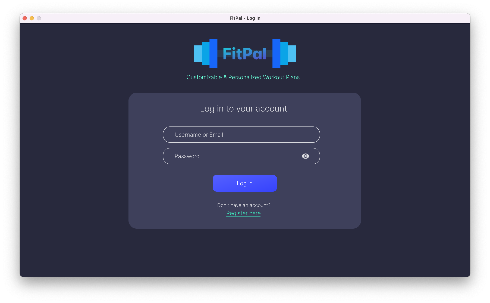
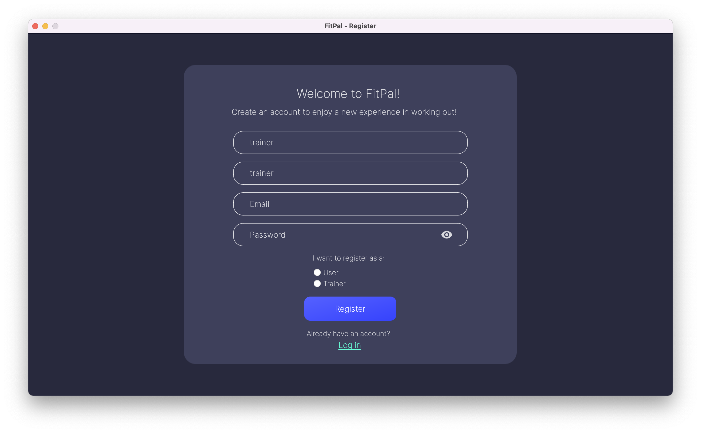
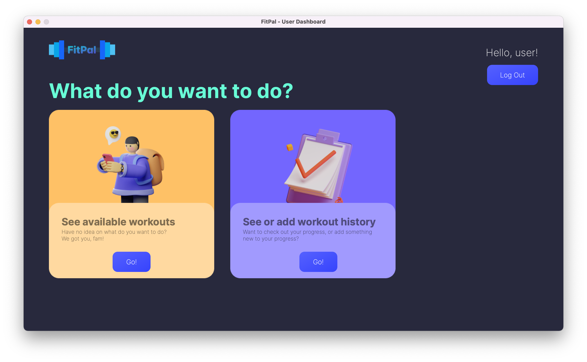
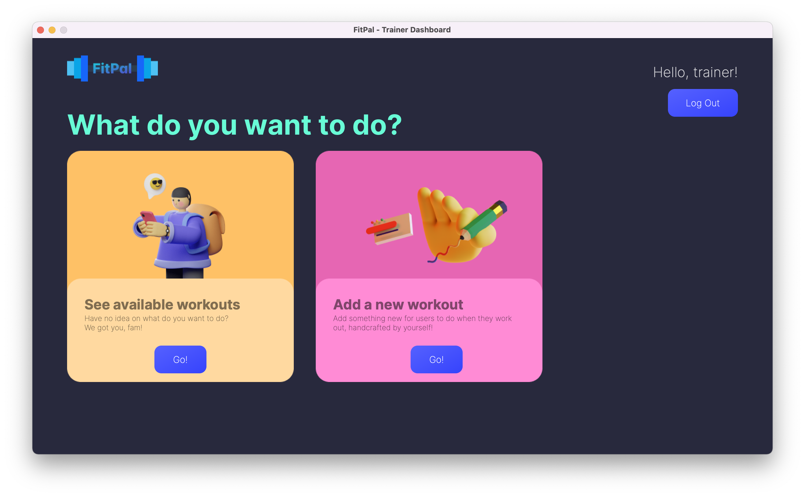
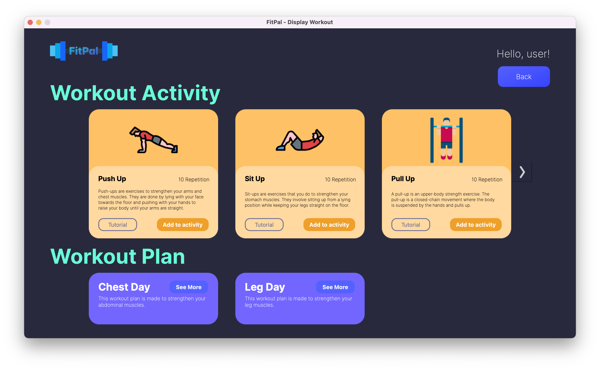
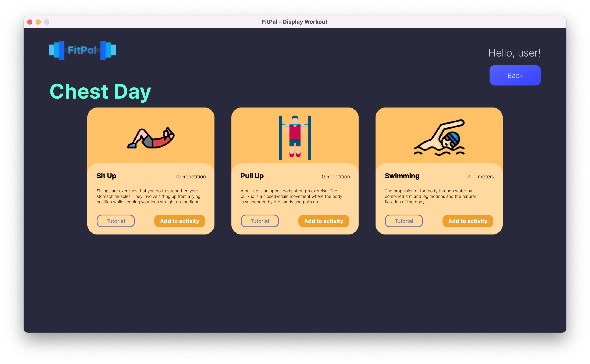
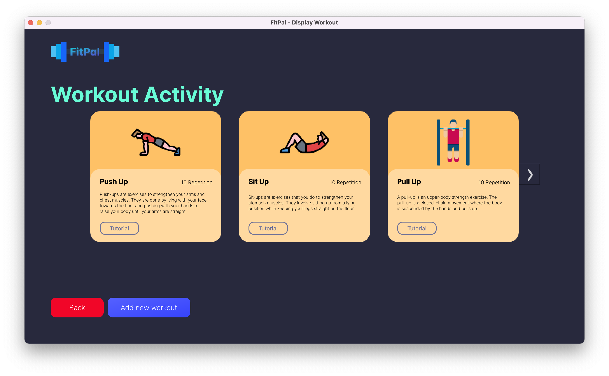
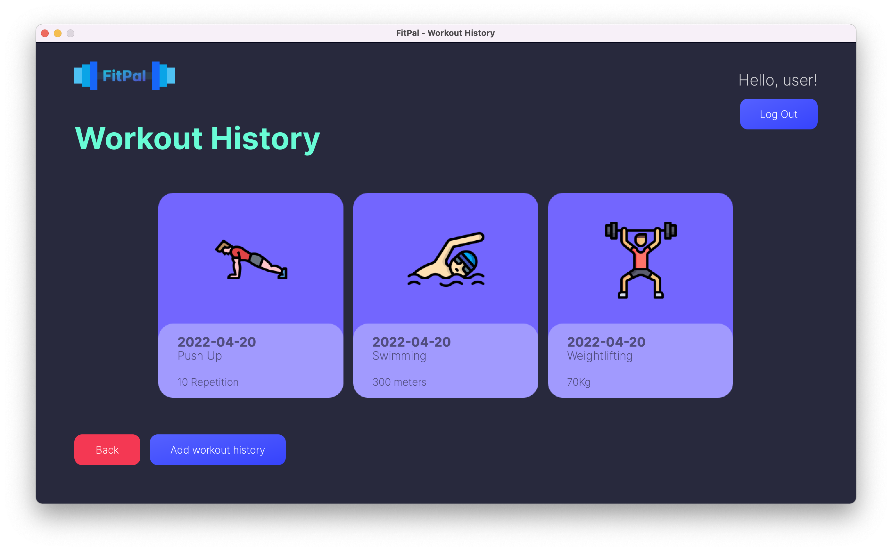
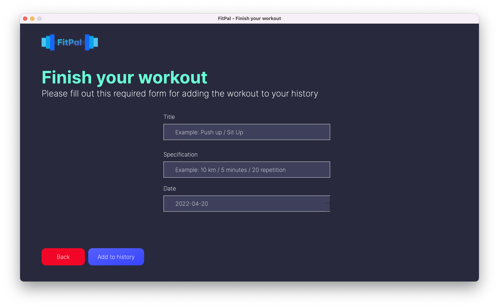

# FitPal

FitPal merupakan sebuah aplikasi desktop yang dapat membantu pengguna untuk menyusun program olahraga secara pribadi. Aplikasi FitPal dibuat dan dikembangkan dengan bahasa Pemrograman Python.

## Fitur

Aplikasi FitPal memiliki beberapa fitur, yaitu:

- Autentikasi (Login dan Register)
- Dashboard untuk user dan trainer
- Display workout untuk user dan trainer
- Display workout plan untuk user
- History workout untuk user
- Finish workout untuk user
- Add workout untuk trainer

## _Dependencies_

- Python3
- _library_:
  - PyQt6
  - db-sqlite3
  - requests
  - bcrypt
  - pytest

## Cara Menjalankan Aplikasi

### Untuk Windows

Jalankan file `run.bat`

### Untuk UNIX (Linux & Mac)

Jalankan command `make run` pada terminal

## Daftar Modul yang Diimplementasikan

| Nama Modul      | NIM Penanggung Jawab | Nama Penanggung Jawab           |
| --------------- | -------------------- | ------------------------------- |
| Autentikasi     | 13520119             | Marchotridyo                    |
| Dashboard       | 13520119             | Marchotridyo                    |
| Display Workout | 13520117             | Hafidz Nur Rahman Ghozali       |
| Add Workout     | 13520101             | Aira Thalca Avila Putra         |
| Finish Workout  | 13520029             | Muhammad Garebhaldhie Er Rahman |

### Autentikasi

#### Login

#### Register

### Dashboard

#### Dashboard user

#### Dashboard Trainer

### Display Workout

### Add Workout (Trainer)

### Finish Workout (User)

## Daftar Tabel Basis data yang Diimplementasikan

- user(**id**, fullname, username, email, password, type)
- list_olahraga(**olahraga_id**, name, description, specification, linkIllustration, linkTutorial, forUser)
- daftar_request(**request_id**, user_id, trainer_id, umur, jenis_kelamin, berat_badan, tinggi_badan, tujuan, status, title, description)
- workout(**request_id**, **olahraga_id**, status)
- workout_history(**history_id**, user_id, olahraga_id, name, specification, date)
